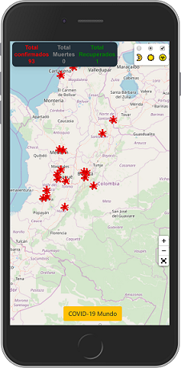

# COVID-19 COLOMBIA

Proyecto realizado para mostrar un mapa actualizado de las personas afectadas por el coronavirus en Colombia, usando herramientas como:

- Leaflet
- Leaflet FullScreen
- Leaflet Edgebuffer

### Como Probarlo

Puedes verlo [aquí](https://jorgevels.github.io/covid-19-col/) o seguir la guía sobre **Como Utilizarlo**

### ¿Como Utilizarlo?

Puedes descargar el proyecto y ejecutarlo en un servidor web, si tienes NodeJS puedes instalar el paquete **live-server** y ejecutar el comando

```cmd
live-server
```

### Imágenes

**Versión Móvil**



### Creditos

Este proyecto fue desarrollado en inspiracion en un video del canal de **Leonidas Esteban** en el cual implemento la API Key de google maps.

- Pueden ver la clase original [aquí](https://www.youtube.com/watch?v=UlfacaW8634)

- Buscando otras alternativas ya que libreria de google maps dejo de ser gratuita me guie con el proyecto de Stalin Maza.

## Autor

> Jorge Velasquez - Frontend Development
> Creditos a Stalin Maza - Desarrollador Web que publico un link del proyecto que realizo utilizando la libreia Leaflet con la cual nunca habia trabajado y me sirvio su proyecto para tenerlo como referencia y aprender de esta libreria.
